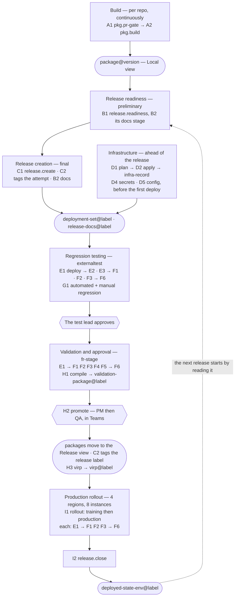

# Project Daybreak — the plan

**1 September – 30 October 2026.** Getting a Viedoc release from stage to production in one day.

What gets built, who builds it, in what order, and what we are deliberately not doing.

**Four documents, and they do not overlap.** This one is the project — streams, owners, milestones,
scope. [`pipelines.md`](pipelines.md) is why each pipeline exists.
[`pipeline-specs.md`](pipeline-specs.md) is how to build each one.
[`documents.md`](documents.md) is what a release puts on paper. If two of them state the
same fact differently, that is a defect in one of them — report it rather than picking.

**Status: draft.** The work streams, the scope boundary and the shape of the end state are agreed.
**The milestones are not, and ⑮ has no owner.** The drill dates are in §5: Drill 3 is Fri 23 Oct, Drill 4 is Fri 30 Oct, and there is no Drill 5 - the real 4.98 release is the proof (T699).

| | |
|---|---|
| The goal | From the test lead's approval to live in all four regions, inside 24 hours. Hotfixes and security patches are the real prize |
| The proof | **Five release candidates of 4.98, and then 4.98 itself.** Decided 2026-09-08: 4.97 goes to production in the last week of October on the old process, and Daybreak's first real release is **4.98**, **frozen Fri 2026-11-06** — a week after 4.97 reaches production and a week after this project's window closes. So the drills are not rehearsals standing in for a release; they are that release, run early and often. 4.96 shipped in week 1 on the old process |
| The shape | The pipelines in [`pipelines/pipelines.json`](../pipelines/pipelines.json), 15 work streams (①b runs beside ①), 6 milestones |
| Who builds it | The teams that own the code. The core team owns the picture and the release pipelines themselves |

---

## 1. How the work is organized

Five rules.

**1 · Build beside, never on top.** Everything lands in `Delivery`, the repository created for
Daybreak. Nothing modifies a
pipeline a release depends on. Where we reuse code we **copy** it — no shared template repository,
no cross-repo includes, nothing pointing back at `Infrastructure`. The old path stays live until a
real release has gone out on the new one. Two reasons: a hotfix may have to go out mid-project, and
every mistake has to be reversible without a rollback plan.

**2 · All the pipelines exist from day one.** Every one of them is created in week 1 as a shell —
it runs, it prints what a person does today, and it hands off to the next one. The chain runs end to
end from the first week even though almost none of it is real yet.

Teams replace one shell at a time, and the manual step stays inside the pipeline until the
automation is ready to take its place.

**3 · No work stream blocks another from starting.** Every pipeline can be hooked into the chain
whenever it is done, in any order — if PQ lands before IQ/OQ, PQ hooks in and the chain still runs.
That is a claim about *sequencing*, not about independence: **ten streams depend on another stream
to finish**, and each is named where it applies in §3 — ④→⑤, ⑤→E1 and ⑤→⑪'s `db.migrate`,
⑥→⑬, ⑦→②'s framework choice, ⑩→① and ⑩→①b, ⑫→⑩, ①→⑮ and ①b→⑮. Read them before committing to a date.

**4 · Three things land in every team's own repo.** **Main is always releasable** (①b), **a PR that
isn't release ready cannot merge** (⑩), and **the build publishes what the release needs** — migration
scripts, the DB hash and the unit test report, alongside the binaries (A2, work stream ⑭). A build has
to check out the product source, so it stays with the source.

Each of the three has an owner who writes the contract and drives adoption; what changes in a product
repo is still that team's change to make. Adoption is per package and visible: `release.readiness`
reports which packages are still missing a `dbHash`, so it is a number read every drill rather than a
thing chased.

**5 · The core team owns the picture, the teams own the how.** The Daybreak core team — Majd,
Oscar, Binish and Sebastian — defines what each pipeline is for and what it must produce. The team owning it decides which checks that means and how they are
written. Prescribing the work down to tasks and then asking somebody else to own it are
incompatible.

---

## 2. The end state

### The chain



The loop closes at I2 → B1. A release ends by writing down what is now live; the next release starts
by reading it. Nothing re-derives the current state.

**The loop is open until M5.** B1 runs from M2 and I2 does not exist until M5, so for every drill
before then there is no previous deployed-state to read. B1 has to run correctly without one — which
is also true of the first real release on the new chain, whenever that is.

### The pipelines

The list is the register, [`pipelines/pipelines.json`](../pipelines/pipelines.json). The order a person queues them in is
[`pipelines/run-order.md`](../pipelines/run-order.md). Most run during a release; three are marked —
`pkg.pr-gate` and `pkg.build` run per repository on every merge, `infra.drift` runs nightly.

**J2 went on 2026-09-14**: `release.status` published the JSON a status page
would read, and J1 — the only thing that was ever going to call it — is deferred to M6, with
`DECISIONS.md` 31 standing in its place. A shell with no caller advertised a capability we do not
have. The ask behind it is real and unanswered: failure legible at block level. J2 returns with J1.

**B2 stopped being a pipeline on 2026-09-13**: `release.docs` was dropped once the
scope froze at C1, which left the correction it existed to publish invisible to it. B2 is a `docs`
stage inside B1 and C1, and holding a shipped release's documents to the ones that shipped is
`release.regenerate`, which reads no work item.

**C2 stopped being a pipeline on 2026-09-06.** It was `release.branch`, and it became a `tag` stage rather than a
pipeline: a pipeline of its own would fetch the same set again and be a second thing a person has to
remember to queue, which is the ritual the stage exists to end. Register order 07 is a gap, which is
what the odd numbering is for. **Two tiers since 2026-09-12**, and still no pipeline of its own: C1
tags every attempt it publishes under that attempt's run id, and H2 tags the release label on the set
that was approved. A set is composed as many times as it needs to be and a tag never moves, so the
attempt tier is what makes both true at once.

**A1 and A2 both live per repository, and they do it differently.** `pkg.pr-gate` is **one
definition** in `Delivery`, attached as a build validation policy on main in each product repo — it
never checks out code, so one of it serves all of them. `pkg.build` is **one per repository**,
because a build has to check out the product source; `pkg.build` is the name of the contract, and
each repo's pipeline takes that repo's name. The scheme is not settled — the shape proposed is
`viedoc.designer.build`.

**There is no separate hotfix path.** A hotfix runs the same chain as everything else; it is smaller
because a hotfix is smaller — one package instead of 39, no translation, a subset of the PQ. Adding
a short path would mean a second process to keep correct, and the release we most need to trust is
the one that goes out fastest.

**"Real by" is the milestone at which a pipeline stops being a shell.** All of them exist in week 1:
each one runs, prints the manual step it will one day replace, and hands off to the next. This
column says when it stops printing and starts doing the work.

| # | Pipeline | Its one job | Stream | Real by |
|---|---|---|---|---|
| A1 | `pkg.pr-gate` | Refuse a PR into main that isn't release ready · *per repo* | ⑩ | M3 |
| A2 | `pkg.build` | Build one package and publish artifacts, migrations, DB hash, unit tests · *per repo* | ⑭ | M2 |
| B1 | `release.readiness` | Answer "are we ready for 4.99?" and change nothing | ⑪ | M2 |
| B2 | the documentation pass | Generate every document that can be generated — nine, from the declaration. A `docs` stage inside B1 and C1 | ⑥ ⑨ | M2 |
| C1 | `release.create` | Pin every package version, label the work items, publish the manifest, tag the commits the attempt pinned | ⑪ | M2 |
| D1 | `infra.plan` | Bicep what-if for one environment | ③ | M5 |
| D2 | `infra.apply` | Apply the pinned infrastructure, never older than what is applied, and publish its receipt to the feed - no tag (`DECISIONS.md` 18 as amended) | ③ | M5 |
| D3 | `infra.drift` | Prove the code still describes reality · *nightly* | ③ | M5 |
| D4 | `env.secrets` | Import declared secrets into the environment's key vault | ③ | M4 |
| D5 | `env.config` | Apply app configuration for one environment from code | ③ | M4 |
| E1 | `env.deploy` | Deploy one release label to one environment, in block order, on slots | ⑪ | M3 |
| E2 | `db.migrate` | Run the migrations, gated on the history table and then the schema hash | ⑪ | M3 |
| E3 | `env.tasks` | Run the declared pre- and post-release tasks | ⑪ | M3 |
| F1 | `qual.iq` | Record what is actually installed, by observing the environment | ⑧ | M3 |
| F2 | `qual.oq` | Prove every declared endpoint responded healthy | ⑧ | M3 |
| F3 | `qual.smoke` | Walk the important user flows end to end — Playwright, PQ's framework | ⑦ | M3 |
| F4 | `qual.pq` | Run the PQ suite · *stage only* | ② | M4 |
| F5 | `qual.regulatory` | Run the regulatory suite · *stage only* | ② | M4 |
| F6 | `env.qualify` | Compile one environment's qualification into one package | ⑧ | M3 |
| G1 | `test.automated` | Run the automated functional suite against externaltest | ⑪ | M3 |
| H1 | `release.compile-validation` | Assemble everything that says this release is valid | ⑪ | M4 |
| H2 | `release.promote` | PM then QA approval, the packages become releasable, and the release label is tagged on what shipped (C2) | ⑪ | M4 |
| H3 | `release.virp` | Repackage the signed validation package as the VIRP — 13 files | ⑪ | M4 |
| I1 | `release.rollout` | Take one promoted release through one region | ⑪ | M5 |
| I2 | `release.close` | Record what is now deployed and file everything | ⑪ | M5 |
| J1 | `release.run` | Run B → I in order, wait for each, restart only what failed | ⑪ | M6 |


### The 30 documents

A release also produces paper, and the same rule applies: **a generated document is finished the
moment it is generated.** Machine identity — what produced it, from which run, at what time — no
hand edits, immutable where it lands, filed by the pipeline that made it.

Verdicts are from [`documents.md`](documents.md#what-gets-automated) and **none of them are
confirmed with QA**. The *Produced by* column is this plan's addition — `documents.md` maps each
document to an initiative, not to a pipeline. **Blank means nobody has said which pipeline makes it.
Those blanks are work stream ⑬.**

**13 in the VIRP**

| Document | Verdict | Produced by |
|---|---|---|
| VIRP Introduction | generated | H3 · static |
| Clinical Trial Cloud System Checklist | generated | H3 · static |
| Acknowledgement Form | generated | H3 |
| VIRP Change Summary | generated | — |
| User Requirement Specification | generated | B2 |
| User Requirement Traceability Matrix | generated | B2 |
| Impact Assessment spreadsheet | **decide first** — T46, and a draft of what a generated one would say exists since 2026-09-05 | — |
| Release Note | generated | B2 |
| EDC Management Sheet (EN) | stays manual | — |
| EDC Management Sheet (JP) | stays manual — T47 | — |
| Quality System Table of Contents | generated | — |
| Validation Summary Report | generated | H1 |
| Release Certificate | generated **if it survives** — T87 | H2 |

**17 outside it**

| Document | Verdict | Produced by |
|---|---|---|
| Release configuration report | generated | B2 |
| Handover documents | **stops existing** | — |
| Ops runbook | **stops existing** | — |
| Redacted DB query log | generated | E3 |
| Current-IQ capture | **stops existing** — replaced by I2's deployed-state artifact | — |
| Stage IQ | generated | F1 |
| Stage OQ | generated | F2 |
| Production IQ · one per region | generated | F1 |
| Production OQ · one per region | generated | F2 |
| PQ specification | generated | F4 |
| PQ results document | generated | F4 |
| Regulatory suite results | generated | F5 |
| PQ run evidence | generated | F4 · retained by I2 |
| Translation certificates | stays manual — supplier document | — |
| VIRP zip | generated | H3 |
| Learning lesson PDFs | stays manual | — |
| Learning review and diff PDFs | stays manual | — |

**21 generated · 3 stop existing · 1 to decide · 5 stay manual.** Nineteen of the 21 have a producer
here: eighteen since 2026-09-05, when the Acknowledgement Form went to H3 and the Release Certificate to
H2, and the PQ specification, which moved here from *stops existing* on 2026-09-30, from the PQ's gate. Two
still do not — VIRP Change Summary and Quality System Table of Contents — and neither does the Impact
Assessment, which needs a decision first.

**B2 generates nine documents, and only four of them are in these 30** — the URS, the URTM, the
release note and the release configuration report. The other five are the User Requirement Listing,
the Detailed User Requirement Specification, the Test Specification, the Test Results and the Bug Fix
Specification: the Report Generator produces them every release, and the day 1 walkthroughs did not
name them. Whether that makes the count 35 is ⑬'s to settle with QA;
[`documents.md`](documents.md#the-nine-releasedocs-generates) lists the nine.

**Fifteen of the 30 need a number typed off the numbering spreadsheet.** Until that has a
replacement, machine identity is unachievable for half the set — which is why ⑬ item 4 is a blocker
rather than a tidy-up.

### The dependencies that shape it

**The release label is the only join key.** `release.create` writes it; every pipeline after it takes
the label as its single meaningful input and resolves everything else from the manifest.

**Provision-and-deploy always qualifies.** There is no environment where deploying and not
qualifying is a valid state. E1 always runs IQ, OQ and smoke as its own last stages — the jobs F1, F2 and F3 run — and no
parameter skips them on a run that deploys. Only `dryRun` leaves them out, because a dry run deploys
nothing to qualify.

**Deploy order is three static blocks, deployed and switched one at a time on slots:**

```
  block 1                     block 2                block 3
  AUTH + SHARED               CLINIC                 OTHERS
  ─────────────               ──────────             ─────────────────
  IdP                         Clinic                 me  →  me web
  me-idp                      Worker                 Coder API → worker → web
  STS                         API                    sdv-man
  e-mail/SMS proxy            Designer               RTSM → logistics
  PDF service                                        eTMF
  virus scanner                                      Reports

  deploy → verify → switch    then block 2           then block 3
```

A block cannot switch until it is green, and block *n+1* cannot start until block *n* is live —
an OQ against a slot sees the live version of everything else. Two consequences:
**no breaking change without a version**, and deployment and release come apart — deploy everything
on Monday, flip Japan on Thursday.

**Four properties the chain has to have, and where each is enforced:**

| Property | Enforced by | Real by |
|---|---|---|
| Nothing reaches production unapproved | E1 and I1 resolve packages from the `Release` view; only H2 puts anything there | M5. **Nothing has ever reached the `Release` view** — 32,933 of 32,937 package versions in the `Viedoc` feed sit in `Local`. Both halves are new work |
| Nothing deploys onto stale infrastructure | E1 gate 2 — each pinned infrastructure package's receipts for the region and the environment, `infra-record-<package>-<instance>`, applied at the pinned infrastructure version or higher | Real on dev from the first `shared` version: D2 and dev.deploy provision and publish the receipt. Stage and production the same, region by region, once `regions.json` opens one - its two connections named and Platform approving each apply; a region still held provisions nothing, and passes while the pinned package holds nothing for it |
| Nothing deploys without qualifying | E1 always runs IQ, OQ and smoke as its own last stages on every run that deploys; only a dry run, which deploys nothing, leaves them out | M3 |
| Nothing is claimed that was not observed | F1 reads the control plane, E2 compares the DB hash, F2 parses the response body | M3 — **conditional on T100**, how to IQ, which has never been discussed |

---

## 3. The work streams

### ① Run test cases on a dev environment before the merge
**Owner: Daniel B.** · Week 1, a conversation rather than code

**Why.** Test cases and test results run on externaltest *after* the branch has merged to main —
main, or whatever a repository calls its default branch. That is the single reason main cannot be
trusted, and every gate below this one assumes it can be.

**Goal.** Agree with Daniel and the test leads where test cases run: on the team's own dev
environment, against the branch brought up to date with main, before the merge. Plus one concrete
ask: the automated suite needs its own instances rather than sharing the test database.

**Done when.** A PR to main can be blocked on "TC and TR linked and passed" and nobody argues about
where they ran.

**Pipelines.** None of its own. It is what makes ⑩'s TC/TR check fair.

**Agreed in principle 2026-09-01**, with Daniel B., Binish, Majd and Oscar. Test cases and test
results run on the team's own dev environment before the merge. The merge to main is the gate.
externaltest stops being a place teams run test cases. **Preliminary** — Daniel takes it to the
testers and owns the SOP rework. Notes, the whiteboards and the transcript are in
the ① stream document.

**The environment split it decided.** **integration** always runs latest main — dev7 is already
this in practice. **regression** carries release candidates only and stays frozen — externaltest
today. Neither accepts a deploy from a feature branch. Two things follow: regression stops blocking
everyone else's merges, and nothing goes on *any* environment except a pinned set, a dev environment
included. The room called that a *release package* and it is the deployment set of `DECISIONS.md` 14
and 15, settled the same day — so it is C1 and E1 applied internally, not new scope.

**Closed 2026-09-11.** The stream's scope was to decide it, sync it with the people it affects and
give it time to land. Nine days on, nobody has disputed it and at least one team is already working
this way, so there is nothing left for the stream to hold. **What does not close with it:** Daniel
taking it to the testers and owning the SOP rework, and ⑩'s rollout, which still waits on the tech
leads briefing their teams and feeding back.

**Open.** Test data now has to exist on a third environment, which is a problem that already exists
and gets its own meeting. Whether the automated suites run on both integration and regression.
Feature flags per environment. Whether the SOPs actually require test cases to run on external test
— nobody was sure, and test execution and case authoring were meant to be separate people when
there is now one tester.

### ①b Only merge to main when the work is release ready
**Owner: Oscar, with the tech leads** · Week 1

**Why.** Work reaches main and is only then finished off: a second round of test cases, the
work-item review, the release label and the last of the work-item information all land after the code
is already there. That is why main cannot be trusted, and a one-day release — a hotfix above all —
has to ship what is on main without first working out what in it is safe.

**Goal.** Get the rule agreed with the tech leads and written down: work merges to main only once
it is complete, so the merge becomes the last thing you do rather than the first. A second topic in
the same meeting: **breaking changes**
— block-by-block deployment on slots means an application cannot assume everything around it moved
at the same time. Taken to the tech leads as a question, not a rule.

**Done when.** The tech leads have agreed it, and the SOPs are updated where they have to be.

**Pipelines.** `pkg.pr-gate` and `pkg.build` rest on the agreement.

**Note.** This is the one item most likely to generate pushback, which is why it starts in week 1
even though there is little to build. Neither this nor ① should surprise anyone.

**① went first.** The test side was agreed in principle on 2026-09-01, so this meeting takes the
same rule from the dev side rather than opening it. Two dev-side questions came out of that room and
belong here: feature flags for work that spans releases, and how a team pins its own component to a
feature branch while everything else stays latest.

**Agreed in principle 2026-09-02**, with Joakim, Linus, Binish, Rikard, Sebastian, Micke and Oscar.
The room's words: *"at least on the principal level, we're all aligned."* The tech leads take it to
their teams and **⑩ is not enabled before they have**. Notes, the problem below and the transcript
are in the ①b stream document.

**The goal came back sharper.** Trunk-based does not mean a merge is forbidden until the code is
provably releasable, and testing everything before a merge is not realistic when a full run takes
hours. Two halves, both wanted: shift left what can be checked cheaply before a merge, **and** keep
an automatic answer to "are we releasable right now" from nightly runs on the integration
environment, with a dashboard and reverting when it is red. The second half is most of what dev7 was
built for, so it is the same work ① needs from the other direction.

**Open, and it is a real one.** **A work item that spans several repositories** — a large part of
the work. Closing the item when a PR merges breaks, because the first PR to land is not the last
piece of work. One work item per PR was rejected as rigid. The likely first version closes only when
the last linked PR has merged, and it is input to ⑩ rather than a decision. Underneath it, **an epic
or feature with PBIs under it is a label that is never closed** — those are the ones the internal
reporting tool reads — so grouping work larger than one item has no home there. Out of scope, and it
is why the first problem is hard.

**Closed 2026-09-11**, with ①, on the same reasoning: decide it, sync it, give it time to land, and
nobody came back to dispute it. **⑩ is unaffected** and still does not switch on before the tech
leads have briefed their teams and fed back. Four reminders about how we use Tech Backlog Items,
Epics and Features came out of the same meeting and sit on top of the epics-and-features problem
above rather than inside this stream.

### ② Fully automate the PQ test suite
**Owner: Ganesh / Daniel / Surya** · Runs the full eight weeks

**Why.** The PQ is manual setup, pipelines that fail and get rerun, and a report written by hand —
and it takes one person who knows how.

**The target: Platform can run the PQ.** Nothing to set up, nothing to do other than trigger a
pipeline.

That is not about who owns PQ. It is the test of whether it is automated: deploying to stage triggers
it, and it comes back green or it doesn't.

**Goal.** Rebuild the PQ suite on the new Playwright framework, and consolidate the regulatory
suite into the same repository, selected by filter. Evidence produced by the run — every step traced and
screenshotted, one package. The 24-hour Reports sync test replaced with a check that doesn't wait.

**Done when.** `qual.pq` runs after the stage deploy with no person in the loop, and its output is
the PQ result.

**Pipelines.** `qual.pq`, `qual.regulatory`. Probably `qual.smoke` as well — see ⑦.

**Where it runs, decided 2026-09-29.** The suite has a repository of its own, `Qualification`, and is
a package the set pins (decision 53). The PQ is a stage group of `env.release` on fr-stage after
smoke — one lane per browser on a Microsoft-hosted agent, then one stage that records all four and
fails if any is red — and `qual.pq` runs the same stages on their own.

**Fallback if the full suite can't be cut down in time.** Build a small automated suite — five test
cases — that runs inside the new process, and keep the old PQ running beside it. The pipeline shape
is what matters for the drills.

**The framework is a new one built on Playwright**, and the suite has moved off Selenium onto it.
The regulatory suite and ⑦'s smoke test sit in the same repository on the same framework, selected
by filter. **Product teams keep their own frameworks for their own functional tests.**
Consolidating those is Daniel's call and outside this stream, and what is wanted from it is narrower
than a shared framework: a page object written once by the team that owns the product, reusable by
whoever tests it. Decided 2026-09-11.

**Open.** Agents. The lanes run on Microsoft-hosted `windows-2025` today, which is **Windows Server**,
and the PQ specification names Windows as the machine it runs on; whether that holds, and which
browsers move to Linux, is QA's call (T655). Wall-clock targets are set: 4h target, 8h worst
case, 1h for hotfixes. **A PQ subset for hotfixes needs a selection rule QA signs once (T68)** — with
no separate hotfix path, that subset is what makes a hotfix fast. Constrained by our own GAMP 5
statement, which says security updates are verified by both OQ and PQ.

### ③ Migrate the infrastructure to Bicep, and stop configuring environments by hand
**Owner: Sebastian / Platform** · Runs the full eight weeks

**Why.** Infrastructure is described in several places, in two languages, with manual steps in
between. `Terraform` and `TerraformModules` hold most of it, `DNS` and `AG` carry parts, and
`Viedoc.Infrastructure` still holds Bicep from an earlier attempt. The path went ARM templates, then
Bicep, then a refactor to Terraform, and the DACI decision of 2026-05-25 calls the result a
bottleneck: a mix of IaC and manual process, no module usage, no drift detection, weak validation,
client-side orchestration, and no Azure policy evaluation before a deploy. A release cannot refuse to
deploy onto infrastructure that is behind unless that infrastructure is pinned and applied from code,
and today provisioning is manual work carried out ahead of the deploy. **The tech leads and
architects chose Bicep at the tech lead meeting on 2026-05-26 and the target design is written; this
stream is where it gets built.**

**Goal.** Migrate the existing infrastructure to Bicep — a folder per application with
shared modules around them, in `Delivery` or in a repository of its own, which the Bicep shaping day
settles. Drift detection. Secrets and app configuration applied
from declarations instead of typed by hand — roughly 200 secrets today. Central shared services stay
where they are; Azure policies stay with Platform.

**Done when.** `infra.apply` provisions a real environment from code and leaves a receipt on the feed
that the deploy's gate 2 reads (DECISIONS.md 18 as amended 2026-09-30). The first piece is dev's: the
`shared` package, built from AzureInfrastructure, applied to West Europe's region by `infra.apply` and
`dev.deploy`; then one package per product - `<product>.infra` - applied to the region and to each
environment it holds, in the order the set pins them.

**Pipelines.** `infra.plan`, `infra.apply`, `infra.drift`, `env.secrets`, `env.config`.

**Depends on.** The Bicep shaping day, week 1 (T84). The Bicep half blocks nothing hard — until a set
pins a version of `shared`, `infra.apply` says the set's reason and applies nothing, and `env.deploy`'s
gate 2 says SKIPPED with it, so the chain still runs.

**`env.secrets` is the part of this stream that does block, and it is underestimated.** The app-configuration
manual gate rides on **12 of the 34 dispatched packages** — `viedoc_appconfig`, `viedoc_idp`,
`viedoc_meidp`, `emailsmsproxy` and eight more — and each instance waits **four days and then
rejects**. A deploy cannot be hands-off while a human gate sits in a third of the package graph, and
it only disappears when secrets become declarations. **⑤'s worker gate is not the only thing standing
between us and M4; this is the other one, and it is larger.** It needs an answer to where the secret
values live if not an Azure DevOps variable group — a QA and security question, not a technical one.

**Open.** Capacity in France Central, the Container Apps quota (§7), agent pools, and the production
environments. The ask to Platform is one question with a date on it: **what can you deliver in eight
weeks?** After that it is a weekly on-track / not-on-track, not managed work.

### ④ Migrate the Viedoc Worker's PDF generation to Viedoc.PdfService.API
**Owner: Heartbeat** · Runs the full eight weeks

**Why.** `ABCpdf.ABCGecko` is a Windows dependency sitting in the Viedoc Worker's PDF path, which
pins the worker to a Windows VM. Until it is gone, ⑤ cannot finish.

**Goal.** Migrate PDF generation to `Viedoc.PdfService.API`, the Playwright-based service Designer
already runs against — so this is a migration onto something already in production, not a build.

**Done when.** Every PDF renders identically through the new path and the old one is off. That
equivalence is the real risk in this stream, not the migration.

**Pipelines.** None directly. It unblocks ⑤.

### ⑤ Migrate the Viedoc Worker tasks from VMs to Azure Container Apps
**Owner: Heartbeat — Mikael Wallén and Jins Thomas** · Runs the full eight weeks

**Why.** The Viedoc Worker is a legacy console application running on five Windows VMs, so a release
means RDP to each of them and stopping the workers one at a time. On top of that, the
`viedoc-new-worker-started.key` secure file stops `env.deploy` dead on stage and production until a
person acts, which puts it on the critical path to a hands-off stage deploy.

**Goal.** Migrate the Viedoc Worker to Container Apps piece by piece — each task potentially its own
container app. Graceful shutdown on SIGTERM. `Viedoc.Worker.exe -RT UpdateDatabase`, the XPO schema
updater, runs against the main database today and is load-bearing. It is **re-homed into
`db.migrate`, not dropped** — the pipeline that applies a release's migrations and verifies the DB
hash.

**The concrete deliverable Daybreak needs:** remove the `viedoc-new-worker-started.key` secure-file
gate from the deploy templates. Until it is gone, `env.deploy` stops and waits for a person on stage
and production, whatever the pipeline list says.

**Done when.** A deploy to stage completes with nobody starting a worker.

**This is a real dependency, not something running beside.** M4 — a hands-off stage deploy — needs
the gate gone.

### ⑥ Generate the release documents from a pipeline, and retire the Report Generator
**Owner: the core team** · named 2026-08-31

**Why.** The release documentation set is produced on a Report Generator VM, numbered off a
spreadsheet by hand, and edited by hand afterwards. Nothing about it can be reproduced.

**Goal.** Generate nine documents from one pipeline — user requirement specification, user
requirement listing, detailed user requirement specification, traceability matrix, test
specification, test results, bug fix specification, release note, release configuration report — run
twice per release, preliminary then final. The set is a template loop over
`pipelines/declarations/documents.json`, not a parameter: the pass takes `releaseLabel` and
`mode`. It is nine because QA needs every report the Report Generator produces and no two of them
are combined.

**Done when.** Decision 23's test passes — *"regenerating an old release's documents from the same
source produces the same content"* — and nobody opens one to edit it. A generated document is final:
machine identity, no hand edits, immutable where it lands, filed by the pipeline that made it.

**Pipelines.** None of its own — the documentation pass is a `docs` stage inside `release.readiness` and `release.create`.

**Starting material.** Five or six PowerShell scripts and the current Viedoc reports, which Majd
holds and is handing over — there is more testing in it than one person should carry.
The renderer already exists and is the better one: pandoc in Docker with the eisvogel template and a
signature page, working today in `generate.iq.report.yml`.

**Depends on ⑬'s first nine, week 1.** The nine documents the pass generates need their
sources confirmed before anyone writes the generator — which is ⑬'s traceability table, not this
stream's work. ⑬ walks those nine first, so ⑥ starts writing in week 2.

**Closed 2026-09-11.** *"We generate everything there."* Every document the stream owns comes out of
a pipeline and the artifacts are on the runs. **The Report Generator VM does not go with it**: 4.97
ships on the old process and still uses the tool, so the VM is decommissioned after the first
release rather than now.

**Open.** Document numbering — nothing has replaced the spreadsheet (T91). And the Impact Assessment
spreadsheet (T46): generate it from the work-item field or drop it. **Answer that before any code.**
Two things outlive the stream: the page of warnings a readiness run ends on, believed by now to be
false positives, and rotating the credentials committed in the Report Generator repository, which
has to happen whether or not the tool is replaced.

### ⑦ Build a smoke test suite that runs automatically on every deploy
**Owner: Ganesh** · named 2026-08-31

**Why.** What we call the OQ today is a probe per application, so a release can pass every probe and
still have a broken login. Nothing checks that a real path across applications survived the deploy,
or that the block ordering held. Today the gap is filled by an unofficial mini OQ between bundles and
a PowerShell sanity check, both run by hand.

**It is not a bigger version of today's OQ.** What we call the OQ today is a probe per
application — *can each application reach the things it declares it depends on*. The smoke test asks
*does a real path through those applications still work*. Both run on every deploy and they answer
different questions; a release can pass every probe and still have a broken login.

**Whether the smoke test belongs inside the OQ in the wider sense is open.** We equate "OQ" with the
endpoint probe, and that is a habit rather than a definition. ⑧'s ADR fixes what an OQ check is and
it may pull this in. Either way the suite is the same work.

**Goal.** Replace today's unofficial mini OQ run between bundles and the PowerShell sanity check
with one suite living in the same repository as PQ and the regulatory suite — same framework, same
evidence, same reporting, selected by filter.

**The constraint that shapes it: it has to be fast.** PQ runs on stage only and is allowed hours.
Smoke runs nine times in a release, plus once per block against a deployment slot before that block
switches. Minutes, not hours. That is what decides how many flows go in it.

**Which flows** is the first thing to settle, with QA and test. The useful axis is the deploy
blocks — a flow that crosses block 1 into 2 into 3 is exactly what proves the block ordering worked,
which nothing else in the chain checks.

**Done when.** `qual.smoke` runs on every environment as part of deploying, red blocks that
environment, and it can be pointed at a deployment slot rather than the environment's public
hostname.

**Pipelines.** `qual.smoke`.

**Note.** It belongs with ② rather than ⑧ — it is closer to the PQ than to the OQ. It lands on ②'s
framework, the new Playwright one, in the repository that already holds the PQ and the regulatory
suite.

### ⑧ Automate the IQ and OQ, and define one OQ check every application meets
**Owner: Phoenix** · confirmed 2026-08-31

**Why.** Today's IQ reads resource tags and past pipeline runs, so it never touches a running
application — it reports back what we wrote down. And the OQ endpoints have drifted apart between
applications, with the documents people point to never having been agreed. **Settling one definition
of what an OQ check is, the same in every application, is the bigger of the two.**

**We are aiming for the full thing.** Not just automating the OQ as it stands. IDP does not work
the way Viedoc does, and fixing that drift under one owner, once, is far cheaper than fixing it per
team over a year.

**Goal, in three parts.**

1. **The contract.** One ADR in the architecture repository: what an OQ endpoint must return, what it
   must check, and what belongs in the smoke test instead. Agreed between QA, dev and Platform. It
   also settles what the difference between a smoke test and an OQ is. The working answer: the OQ
   checks that each application can reach its declared dependencies.
2. **Conformance.** Bring every application's endpoint to the contract. This lands as PRs into the
   owning teams' repositories, with those teams reviewing. **How many applications that is was
   itself unanswered, and was measured on 2026-09-17: 40, of which 16 have an endpoint today.**
   Until then this said 19 declared and 17 checked; both were wrong by one and both were counting
   something other than applications. `applications.json` declares 18,
   `Get-ApplicationsToHealthCheck.ps1` implements 16, `products.json` holds 19 products and 52
   packages, and the 52 expand to 40 applications. Reconciling the lists is still the first task of
   this part, and `qual.oq` needs it anyway.
3. **The pipelines.** `qual.iq` observes the environment. `qual.oq` is **not** the thin wrap this
   said until 2026-09-17: `health.check.report.yml` publishes an OQ report, but it asserts only that
   the status code is under 400, it never parses a body, and it drops an application declared for
   health checking that its hardcoded list does not carry. `env.qualify` compiles both.

**Done when.** The contract is written and agreed, every declared application meets it, and an IQ
fails when what is installed differs from what the manifest pins.

**Pipelines.** `qual.iq`, `qual.oq`, `env.qualify`.

**Sequencing.** The contract and the pipelines land by M3 — `qual.oq` works against whatever conforms, and
reports non-conformance rather than blocking. **Conformance lands application by application, and
the last one by M5**, when `qual.oq` starts blocking on it.

**Size.** Part 3 is about a week. Part 2 is where the time goes, and it is spread across teams
rather than concentrated in one. **This is the first place extra capacity should go.**

**Fallback if it does not fit.** Automate the OQ exactly as it is today, store the results, and make
the alignment separate work after October. Take that decision at the M3 evaluation, not later.

**Open.** How to IQ (T100). It has never been discussed and `qual.iq` is written as if the answer
is "observe the running application". And **what an OQ check actually covers** — we equate it with
the endpoint probe, which is a habit rather than a definition; the ADR may widen it, and ⑦'s smoke
test is the obvious candidate to pull in.

### ⑨ Generate the release note PDF from the work items, ready for review
**Owner: the core team** · named 2026-08-31

**Why.** The release note is written and edited by hand, so it cannot be reproduced and a correction
never makes it back to the source it came from.

**Goal.** Generate the release note from the work-item field — it is one of the nine
the documentation pass produces — and run the review loop as a process. Deliberately **no approval step** — an official approval would create a dependency
— but somebody reviews.

**Done when.** Decision 23's test passes on it — *"regenerating an old release's documents from the
same source produces the same content"*.

**Pipelines.** None of its own — the documentation pass is a `docs` stage inside `release.readiness` and `release.create`.

**Scope line.** The ~60-step authoring and review process, and the review app on top of it, are
**out** — target two. What is in is the generation.

### ⑩ Build the pull request gate that keeps incomplete work items off main
**Owner: Spirit** · named 2026-08-31

**Why.** Nothing stops a work item that is not release ready from reaching main, and everything
downstream in this plan assumes the documentation is already there.

**Goal.** Build **one pipeline definition**, living in the new repository and attached as a build
validation policy on main in each product repo. It validates the *work items linked to the PR* over
the Azure DevOps API and never checks out the code — which is what lets one definition serve every
repository. A copy of the YAML in 100+ repos is rejected.

What it checks: work item complete — description, acceptance criteria, test plan, impact, release
notes; bugs take repro steps, severity, probability, risk and found-in instead · TC and TR linked
**and passed** · feature and epic links · ready for translation · database migrations declared. And
on merge, **set the PBI to Done automatically** — validate everything except the final state, then
force the state, so a work item marked done whose code never landed becomes impossible.

**Done when.** A PR missing any of those cannot complete.

**Pipelines.** `pkg.pr-gate`, and the `pkg.build` extension.

**Depends on.** ①b for the agreement, ① for the TC/TR check to be fair. It rolls out warn-only first.

**One thing to solve before the auto-close is real.** A work item that spans several repositories,
which is a large part of the work — the first PR to land is not the last piece of work. One work item
per PR was rejected by the tech leads on 2026-09-02 as rigid. The shape suggested there: check every
linked PR and set the state only when the last one has merged. T174, and §9.

**Starting material.** Trial Gateway's `IsFeatureEligibleForRelease` covers about half of the checks
and runs on the same Azure DevOps organization, so the field names carry over. Two defects to fix on
the way in: it returns true immediately if the item already carries a release label — so setting the
label by hand bypasses every other check — and it silently skips items that are neither Done nor
merged, so they never appear as blockers.

**Deliberately later, not now.** An AI check on the *content* of what was filled in — whether the
acceptance criteria make sense against the test cases and the results. That is the reason to build
this gate centrally and once. It is out of scope (§4) and it needs ⑫ first.

### ⑪ Build the pipeline chain that takes a release label to all four regions
**Owner: Majd, Oscar and Binish, hands-on** · Runs the full eight weeks

**Why.** Nothing turns a release label into a release in all four regions, and the data such a chain
reads did not exist when the project started: `dependsOn` was populated for 4 of 39 packages and the
real deploy order lived as 15 expressions inside `all.deploy.yml`. Everything else in this plan rests
on it.

**Goal.**

- `Delivery` — permissions set, folder structure in
- **Every pipeline as a shell, in week 1**, chained by `release.run`
- **The declaration layer** — `applications` cut out of `appComponents`, `dependsOn` populated,
  `blocks.json` written, secrets declared per environment
- Then the pipelines nobody else owns: readiness and creation, deploy, migrations, tasks, validation,
  promotion, VIRP, rollout, close, orchestration
- **The status pages, observed rather than reported.** What each dev environment runs, a release train
  anyone at Viedoc can follow in Teams, and the release notes. They are read from what the pipelines
  already leave behind (feed records, runs, the stores) by readers outside the release, so no release
  pipeline gains a step for them, and a page can never be why a release fails. Moved in from *Out* on
  2026-09-28 (Majd): `release.status` was retired for having no reader, and these pages are that reader,
  without its step in the chain

**The critical path inside this stream is not code, it is the declaration layer.** `dependsOn` is
populated for 4 of 39 packages and the real order lives as 15 expressions inside `all.deploy.yml`;
`blocks.json` and the secrets declarations do not exist at all. `env.deploy`, `db.migrate`, `env.tasks`, `env.secrets` and `release.run` all wait on
data, not on code. **It starts on 1 September and it does not need a pipeline to exist first.**

**Done when.** A person queues one thing and a release goes out.

**Pipelines.** `release.readiness`, `release.create`, `env.deploy`, `db.migrate`, `env.tasks`, `test.automated`, `release.compile-validation`, `release.promote`, `release.virp`, `release.rollout`, `release.close`, `release.run`.

**Open.** What the orchestrator is (T82). Buying a tool is out — Octopus Deploy raised and dismissed
on time. An AI agent as a *required* component is argued against. The landing: build the pipelines
with their dependencies declared and orchestrate second. The technical gap to solve is that a
pipeline which triggers another goes green before the other finishes.

### ⑫ Write down what belongs in each work item field
**Not agreed yet. Owner: QA and the tech leads — not the core team**

**Why.** The SOPs describe the process but not the content, so nobody can enforce content — and the
content is what people complain about: documentation arriving incomplete, developers writing their
own test results, nobody reviewing it before it reaches customers.

**Goal.** Write the specification at the level a person or an agent can check against, with a few
real examples to point at rather than templates.

**Done when.** ⑩ can check content and not only presence.

**Why it is here.** It is the missing input for an automated content review, and it is the one thing
in this plan the core team should not write. It goes to QA and the tech leads.

### ⑬ Give every release document a named source and a pipeline that produces it
**Owner: Yupei leads, with QA** · confirmed 2026-09-02

**Why.** ⑥ generates four of the **30 documents** a release produces well, plus five more the 30
does not list. The other 26 are spread across six initiatives and nobody is checking that the set
adds up, so no document has a named source, a named producer and somewhere the pipeline puts it.

**The rule this is measured against**, the same one ⑥ is held to:

> A generated document is finished the moment it is generated. Nobody edits it. It carries machine
> identity — what produced it, from which run, at what time — it is immutable where it lands, and
> the pipeline that produced it files it.

**Goal, in order.**

1. **The walk.** Take each of the 30 and answer three questions: what is it for, can we avoid it, and
   what is it generated from. First verdicts are written in
   [`documents.md`](documents.md#what-gets-automated) — **21 generated, 3 stop existing, 1 to
   decide, 5 stay manual** — and none of them are confirmed with QA. That confirmation is the work.
2. **The traceability table.** For each of the 20, the exact source: which work-item field, which
   pipeline artifact, which declaration. **Where there is no source, either one gets created in Azure
   DevOps or the verdict is wrong and the document is not generatable.** That is the check this
   stream exists to run.
3. **A producer per document.** Every document maps to exactly one pipeline that makes it *and* files
   it. Today they scatter across the documentation pass, `qual.iq`, `qual.oq`, `qual.smoke`, `qual.pq`, `qual.regulatory`, `env.qualify`, `release.compile-validation`, `release.virp`, `release.close` and `env.tasks`, and some have no producer named at
   all.
4. **Kill the numbering spreadsheet.** Fifteen of the 30 need a number typed off it. A registry file
   in the repository replaces it. Until that lands, machine identity is not achievable and rule 5 of
   the pipeline design is unenforceable — so this is a blocker, not a tidy-up.

**Done when.** Every one of the 30 has source → producer → destination written down; no row says "by
hand" except the five deliberately manual; and no document needs a number typed off a spreadsheet.

**Pipelines.** None of its own. It is the specification that the documentation pass, `env.qualify`, `release.compile-validation`, `release.virp`, `release.close` and `env.tasks` build against.

**Depends on.** Nothing. **Blocks ⑥ writing any code** — the same reason T46 already blocks it.

**Sequencing, decided 2026-08-27.** ⑬'s table and ⑥'s documentation pass are both due at M2, and ⑬
blocks ⑥. **The walk starts with ⑥'s nine documents, in week 1** — the nine are in
[`documents.md`](documents.md#the-nine-releasedocs-generates) — so ⑥ can start writing in week 2. The
other 26 run through the rest of the fortnight and the full table still lands at M2. It is the
tightest coupling in the plan.

**Open.** T91 the walk itself · T46 the Impact Assessment spreadsheet, generate from the work-item
field or drop it · T87 the Release Certificate · T47 the EDC Management Sheet, website or VIRP ·
document numbering (T91).

### ⑭ Define one build contract, and bring every package to it
**Owner: Rikard leads** · proposed 2026-08-31, not confirmed · **the core team owns the shared steps, the first package and part 4, end to end** (2026-09-02)

**Why.** Every package a release consumes publishes the same things, in the same shape: the
binaries, the **migration scripts**, the **DB hash** where the package has a database, the
**unit test report**, and — added 2026-08-31 — an **SBOM and a security audit of its third-party
dependencies**. Today `pkg.build` is specified and nobody owns whether ~39 packages actually comply.

**It is a build pipeline definition, enabled for every package we ship** — clinic, designer, coder,
api, me, rtsm, etmf, reports and the rest.

**Why it is a stream and not a note.** This was written as "every team's, in their own repo" — which
described where the change lands, not who makes sure it happens. Somebody has to write down what a
build must produce and how each artifact is formatted, ship the one script that computes the hash,
and then work through the packages. `release.create`, `db.migrate` and every drill from M2 rest on it.

**Goal, in four parts.**

1. **The contract.** What `pkg.build` must publish, in what format, under what artifact names —
   specific enough that a team can check its own build against it without asking. It is the input
   `release.readiness` reads.
2. **The hash script.** One implementation, owned here, so 39 packages do not carry 39 versions of
   it. `~/Development/Repos/DbHash` already matches the rule and needs two changes: the connection
   comes from config rather than an argument, and SHA-256 instead of MD5 (T48).
3. **Conformance.** Package by package, landing as PRs into the owning teams' repositories. Not
   every package has a database, so "DB hash where it applies" is part of the contract, not an
   exception to it.
4. **Clinic's schema files, and the dev tool's retirement — ours, end to end.** Added 2026-09-02
   (Majd): there is no team on Viedoc.Objects, so the core team takes it. The hash of the Clinic
   package is taken from the schema files `viedoc.objects.migrations` carries, and those are
   generated by `viedoc.dev.tool`, which loads the assembly into its own XPO and is right only
   while its Viedoc.XPO matches the assembly's — it produced nothing against today's 15.16.1. We
   replace it with a materializer inside the Viedoc.Objects repository, built with the model so it
   cannot disagree with it, keep skeema for the dump and the diff, and add a check on every merge
   that the files and the model hash the same. The tool's two other callers, the configuration
   push and the deployment provenance, are replaced by the configuration step and by the receipt;
   then the tool is retired. T173, before E2 trusts the hash at M5.

   **The shape, agreed 2026-09-02 (Majd): a command like `dotnet ef migrations add`, clear to
   everyone.** One console project in the Viedoc.Objects repository, run as `dotnet run --project
   tools/Viedoc.Objects.Migrations --` or as a local tool, with two verbs. `migrations add --against
   <branch>` materializes the model into a MySQL in Docker, dumps the schema into
   `migrations/schema/`, applies the target branch's committed schema files to a second database,
   diffs the two with skeema and writes `migrations/migrations/<version>.sql` in the history-guard
   template; the developer commits both in the same pull request as the model change and curates the
   script there. `migrations check --against <branch>` does the same in verify mode and is what the
   PR build runs: it fails with the difference if the committed files do not follow the model or the
   script does not cover the diff, and keeps a curated script that covers it. The pipeline verifies;
   it no longer authors, so the `<branch>-database-migration` branch and its second pull request go,
   and so does building the target branch a second time. The migrations package is the committed
   folder, published at the NuGet's full version on every build that publishes the NuGet (T178), and
   the same materializer feeds the check that the files and the model hash the same on every merge.

   **And it is one file.** .NET 10 runs a single C# file with its dependencies declared at the top:
   `tools/objects.cs` in the Viedoc.Objects repository, `#:project ../src/Viedoc.Objects/Viedoc.Objects.csproj`
   so it is built against the model it describes, `#:package` for the command-line parser, Docker
   and skeema shelled out. `dotnet run tools/objects.cs -- migrations add --against main`. Proven
   2026-09-02 on SDK 10.0.200 with a multi-target library like Viedoc.Objects: first run restores,
   the next runs in a second. Needs the .NET 10 SDK and Docker, which the laptops and the agents
   have; skeema comes from the `viedoc.skeema` package as today until it is fetched from its
   release page. The file's name is the root command, so it is not `migrations.cs`.

   **Migrations are named for the change, not for the version — proposed 2026-09-02 on Majd's
   question, to decide with T173.** Today a script is `<assembly version>.sql` and its MigrationId
   is that version: one script per version, so a version reused by two branches gives two scripts
   one id and the history guard skips the second, and the name says nothing about the change. The EF
   shape fixes all of it: `yyyyMMddHHmmss_Description.sql`, the id being the file name, one migration
   per change, unique by construction, ordered by name, as many per version as there are changes, and
   nothing coupled to `VersionPrefix` any more — the package version says what shipped, the migration
   ids say what changed. `SchemaMigrationsHistory` needs nothing: `MigrationId` is a 150-character
   string. `migrations add` takes the description as its argument, and the tool writes this shape
   from its first migration. **What keeps the old deploy safe is sequencing, and it is ours (Majd, the
   same night): the old path goes with Daybreak, so we manage the cutover.** That deploy sorts the
   scripts with `[System.Version]` on the file name, inside a step that stops on error — Binish
   reproduced it on 2026-09-03 with the task's real setting, where my morning reproduction had used
   a plain shell: a name it cannot parse makes the step report no package and apply nothing, green,
   on every deploy through that path, dev environments included. So the id is the EF shape,
   `yyyyMMddHHmmss_Description`, in the history table and inside the file, and the **file name** is
   the same moment as a version, `yyyyMMdd.HHmmss.sql`, which that deploy sorts after every `15.x`
   file. Files may take the id as their name the day `db.migrate` owns the deploys; ids never change.
   Nothing of ours changes Infrastructure (decisions 2 and 3); instead the first change-named
   migration is merged only when every release still on the old path is behind it, and from then on
   releases run on the new path. With 4.97 locked on 2026-09-08 and T173 landing after it, the first
   such migration is on the 4.98 line, which is where the cutover is planned to be; a cherry-pick of
   a newer Viedoc.Objects into a release branch on the old path is the one move the rule forbids.

   **Undoing a migration — proposed 2026-09-02 on Majd's case: a feature branch deployed to a dev
   instance adds a column, the branch is killed, the column stays.** Two things put a column on a
   dev instance: a migration script, and XPO's own `UpdateSchema` when the Worker starts with the
   branch's model, which adds columns whether a migration was written or not. So one mechanism is
   not enough, and the answer is in two layers. (1) **Every migration carries its reverse.** skeema
   produces the down script by diffing the other way, so `migrations add` writes both, the up as
   today and the down beside it, and `db.migrate` stores the down in the history table when it
   applies the up (`SchemaMigrationsHistory` gains a column, or a sibling table keyed by
   `MigrationId`). From then on the database itself knows how to undo what was done to it: a
   migration in the history that the incoming package does not carry is an orphan from another
   line, and `db.migrate` reverts orphans with their stored down, newest first, before it applies
   what is new — without the dead branch's package, which nobody has any more. (2) **Dev instances
   are reconciled, not only migrated.** For environments of type dev, `db.migrate` makes the schema
   match the package's `migrations/schema/` files, unsafe changes allowed — a killed branch's column
   goes with the next deploy of the trunk's set, and so does anything XPO added with no migration.
   Stage, training and production get the migrations only, and drift is reported, never dropped
   (decision 22, expand–contract, T102). (3) `migrations remove` for the file, EF's meaning: delete
   the newest migration of the branch when it has not been applied anywhere the tool can see, and
   regenerate the schema files. Which of (1) and (2) lands first is E2's design question at M5; (2)
   alone solves the case Majd raised on every dev instance.

   **The Worker's `UpdateDatabase` moves into the same file — proposed 2026-09-02 on Majd's
   question.** Today the Worker's `-RT UpdateDatabase` is XPO's `UpdateSchema` from the model plus a
   write of the `ViedocVersion` row, and it runs on the Windows workers because ABCpdf is registered
   at the Worker's startup, which is why nothing of it runs on Linux. It is the same call the
   materializer makes, so the tool gets a verb for a target: `database update --connection <…>`.
   **Binish's review of PR 40691 (2026-09-03) narrowed it:** on stage and production the migrations are
   the record, and `UpdateSchema` creates silently, so a change it would make there is a missing
   migration hidden behind a green deploy — `database update` is a laptop and dev-instance verb, and
   what a target needs beyond the migrations is generated into the package instead: the `XPObjectType`
   rows as `migrations/objecttypes.sql`, rewritten by every `add` and verified by `check`, and the
   `ViedocVersion` row as a generated file with the release's own number, Viedoc's, not Viedoc.Objects',
   since it leaves the system in ODM exports (T180). `db.migrate` then needs only `mysql`.
   The build publishes `tools/objects.cs` as an executable in its own package, `viedoc.objects.tools`,
   at the NuGet's version beside `viedoc.objects.migrations`, built with the same model, so the deploy
   runs the version's tool against the version's schema with no source and no SDK — framework-dependent
   today, self-contained if the deploy agent's OS needs it, which is E2's to settle.
   **Not built:** `db.migrate` applies the SQL only, and since 2026-09-28 nothing publishes
   `viedoc.objects.tools`.
   `db.migrate` then runs, in this order: revert orphans with their stored downs; apply the ups;
   `database update`, which adds what the model has and the scripts do not, creates XPO's own tables
   and writes the version row, and on the trunk is a no-op by construction once `migrations check`
   holds; then the hash, compared to the package's. The Worker stops touching the schema, on the new
   path — the old one is untouched — which also takes one Windows-only reason out of ⑤'s move of
   the Worker to Container Apps.

   **Built 2026-09-02, late night, on Viedoc.Objects branch `Users/mmi/WI/objects-migrations-tool`,
   PR 40691.** `tools/objects.cs` with the four verbs; `check` is the PR build's stage, the migration
   branch and its second PR retire the day the switch flips: with 4.97 freezing, Majd (2026-09-03)
   wants it built beside and turned on when we decide, so nothing that runs today changes — not even
   the root pipeline file. The tool has a pipeline of its own, `build/viedoc_objects.schema.yml`,
   definition 980 under the Daybreak folder, chained to `viedoc.objects.publish` the way `clinic.build`
   was chained to `viedoc.build` until 2026-09-03: when that completes it takes the run's NuGet version and commit and
   publishes the tool as `viedoc.objects.tools` at that version and, for a prerelease NuGet from another
   branch, `viedoc.objects.migrations` at the same version; `main`'s migrations package keeps coming
   from the old stage. It carries the check for the day a branch policy on `main` points at it, which
   is the switch. **Since 2026-09-28** definition 980 is `clinic.schema.check`, `build/clinic.schema.check.yml`:
   pull requests only, `migrations check` and the two schema routes, publishing nothing, required by
   policy 1446. `docs/SCHEMA_TOOL.md` sits beside the old walk-through. Proven on the laptop before the PR: the 173 committed schema
   files equal what XPO makes of today's model, file for file — T170's fear is not the case today;
   `add` on a temporary column wrote the `ADD COLUMN` and its `DROP COLUMN`; `check` passed with the
   migration and failed without it; `remove` restored; `database update` created 173 tables on an
   empty database, wrote the version row, was a no-op the second time, and the result hashes the
   same as a database built from the files, `efc157be…`. Left for the deploy (E2, M5): reading the
   downs, running `database update`, reconciling dev instances. Left in Viedoc4 (T178): taking the
   migrations version from the referenced package rather than the assembly.

**One conflict to settle before the contract is written.** The 2026-08-31 list has the build
publishing **SQL pre/post scripts**; T102 proposes dropping `preSql`/`postSql` altogether and
replacing them with declared `tasks[]`, because expand–contract leaves no pre/post step to prove.
Both cannot be right. Settle T102 first — it is ⑭'s decision to make, not a detail.

**Done when.** `release.readiness` reports zero packages missing what the manifest needs, and no
release document is assembled from an artifact somebody produced by hand. And, since 2026-09-02, the
schema files Clinic's hash is taken from are proven to follow the model on every merge, with no
tool of ours loading the package's assemblies.

**Pipelines.** `pkg.build` — as a change to each team's existing build, not a new pipeline in this repository.

**Depends on.** Nothing. **Blocks** `release.create`, `db.migrate` and every drill from M2 onwards.

**Open.** Whether the contract is one document or a schema the pipeline validates against. The
second is better and costs more.

### ⑮ Keep the dev and integration environments up-to-date automatically
**No owner** · added 2026-09-03, no dates until it has one

**Why.** ① and ①b were both agreed on a claim nobody owns: that the environment a team tests on is
equivalent to the one regression runs on. It is not. Nobody knows the state of any dev environment,
they drift, and some applications are not deployed to all of them. Until an environment is current
*by construction*, "run the test cases on your own dev environment before you merge" is a promise
the machinery cannot keep. The pieces mostly exist and are connected to nothing.

**Goal.** Five things.

1. **A merge to main reaches the integration environment on its own.** `set.integrate` composes a
   set from latest main and nothing deploys it. That missing link is the whole of *"regression
   testing no longer blocks DEV work"*.
2. **A team can bring its own environment to latest, keeping the branch under test.** Everything on
   devX at latest main except the branch being tested, through the ad-hoc set, asked for from a
   pipeline rather than assembled by hand.
3. **The guardrails enforced in the deploy.** Which kind of set may reach which environment.
   `DECISIONS.md` 15 says decision 16 enforces it. But 16 is production-only, so nothing today stops a
   feature build reaching integration or regression — which ① agreed must be impossible. One of the
   two is wrong: either 16 widens or `env.deploy` gains the check.
4. **`test.automated` runs where it is needed** — integration as well as externaltest, which is what
   both meetings assumed and no document says.
5. **What each environment actually has**, and a reason for anything missing. The other half of 2,
   and the same list ⑧ reconciles, so it is done once.

**Done when.** Nobody asks what is deployed on a dev environment, the integration environment runs
latest main with no person involved, a team reaches latest-plus-its-branch in one run, and a feature
build cannot reach integration or regression at all.

**Pipelines.** No new ones expected. `set.integrate` and `set.adhoc` exist, the deploy is
`env.deploy`, and what is missing is the trigger, the guardrail and the request path.

**Depends on.** ⑪ for `env.deploy` and the composers, ③ for what the integration environment needs.
**Blocks ① and ①b in practice** — both were agreed assuming this work happens, so it is a
prerequisite in the shape of a follow-up.

**Open.** The owner, before anything else. Then whether the integration environment is dev7 renamed
or something new, whether the suites run on both environments, and test data on a third
environment. The stream document in the project folder carries where each gap came from.


---

## 4. What we are not doing

Named so nobody has to guess. Several of these matter more than things that are in scope; they are
out because eight weeks is eight weeks.

### Out — inside the release process, deferred

| | Why, and where it goes |
|---|---|
| **Regression testing itself** | Its own topic, with Daniel B. What changes is the environment it runs on and that its result becomes an artifact — not the testing. ① settled what that means: externaltest becomes regression-only and frozen. Still the single biggest cost line: ~175 person-hours, ~30% of a release |
| **Renaming the environments** | `integration` and `regression` are what dev7 and externaltest already are, and the names should follow — one convention, no special case for external test. Wanted, on the radar, not scoped. The database name cannot follow it, and `externaltest` is still `internal` in blob storage |
| **The browser matrix** | Whether every suite runs on every browser every time is its own decision. With Ganesh |
| **Release-note authoring and review** | ~60 steps, ~4 weeks door to door, plus a review app. The *generation* is in scope as ⑨ |
| **Translation, and Lokalise** | Target two |
| **Viedoc Learning** | Should shift left, but needs Rachel and the teams to agree how. Named as a blocker, not scheduled |
| **Release setup** | Next iteration |
| **The region week** | Staggering regions is a business decision, not a technical one |
| **Cross-department coordination and publishing** | Costs more coordination than it returns now |

### Out — technical work we could do and are not

| | Why |
|---|---|
| **Decommissioning the `Infrastructure` repo** | We copy out of it and stop depending on it. Retiring it is a project in itself, and a lot of what is in there is unused but unclear |
| **Moving the rest of the applications to Container Apps** | Designer, Clinic and the others are containerized and could follow the worker and Reports. Probably right eventually, not in these eight weeks. One answer now, a second answer within a year |
| **Buying an orchestration tool** | Octopus Deploy raised from experience and dismissed on time |
| **An AI agent as a required orchestrator** | Argued against on two grounds: it is strange to require an agent in a regulated process, and if the flow is deterministic an AI is the wrong tool for it |
| **AI review of work-item and release-documentation content** | The obvious thing to add on top of ⑩ later, and everyone wants it. Explicitly not the first thing we start with — it needs ⑫, and it needs the static gate working first |
| **Production container registry** | Called very important, explicitly not in scope. On a test subscription today |
| **Full one-click suite provisioning** | The Bicep end goal. Larger than this project |
| **ProcessWire tooling / MCP for the authoring tool** | Longer than eight weeks |
| **Test containers as the way tests run** | The SDV Manager and Viedoc Me pattern — containers spun up in the pipeline, test data created through the real API, the database torn down after. It would dissolve the test-data problem and the one-feature-per-dev-environment limit, and ①b named it the right direction. Out for three reasons: converting existing coverage is large, it has never been agreed as the department's direction, and it does not fit XPO schema migration, which rules out Clinic, Designer and Admin. A proof of concept beside the existing tests is acceptable |
| **Production observability as a whole** | Logs, dashboards, alerts, and who can reach any of them. There is no overarching plan for how the estate is monitored, and what exists is individual initiative: Platform's new Grafana dashboards for Redis, the services and the queues, and an Azure dashboard built a year earlier by someone else. Named as drift at the 2026-09-04 check-out and put out of scope in the same breath. Two pieces of it are in scope elsewhere and stay there: ③ owns dashboards being declared in code alongside the rest of an environment, and `release.close` files the record of what is deployed where, which today can only be read off resource tags |
| **Reclaiming epics and features** | An epic or feature with PBIs under it is read by the internal reporting tool and is never closed, so grouping work larger than one item has nowhere to go, which is what makes ①b's multi-repo work item hard. Ones carrying only Tech Backlog Items are not read and close normally — which is how Daybreak's own board is built (§7). Erik's initiative, never finished. Named out of scope in ①b's meeting and left on the radar |

### Not out, not decided

Tabled deliberately, and each one changes the size of a stream.

**Settled 2026-09-06:** the release branch does not survive as an automatic act. The `tag` stages tag
the commits a release pins — C1's under the attempt's run id, H2's under the label — and
`Releases/<major>.<minor>` is cut the day a fix needs a home, from the label's tag. What is not
settled is the habit — every team cuts that branch by hand at lock today.

- **Whether the release-approvals stage survives at all** now that the approval sits inside
  qualification (T103)
- **Whether the Release Certificate stays** — an A4 that carries no information, against QA saying
  customers want it. Settled with QA, not among ourselves (T87)
- **The Impact Assessment spreadsheet** — generate it from the work-item field, or drop it (T46). A draft measured against the issued 4.95 sheet and the 4.96.0 scope exists since 2026-09-05: it reproduces 9 of 13 cells, and three of the sheet's thirteen columns name nothing any declaration holds (T249)

---

## 5. The milestones

Six. The first sets everything up; the next four each carry a drill, and each drill runs more of the
same chain for real. The sixth is the real 4.98 release, not a drill.

**The drill dates are 18 Sep, 2 Oct, 23 Oct and 30 Oct.** Five were set on 2026-08-26 - 18 Sep, 2 Oct,
16 Oct, 23 Oct, 30 Oct (T17). **Drill 3 moved to Fri 23 Oct** at the weekly check-in of 2026-10-02, with
nothing deployed on stage, and **Majd decided the rest on 2026-10-07 (T699):** 16 Oct holds no drill,
since it falls in Drill 3's private-run week; Drill 4 is Fri 30 Oct; and Drill 5 is dropped as a drill -
the real 4.98 release, after the freeze on 6 Nov, is the proof. **Majd runs Drill 1 and it
hands over after** (2026-09-08): he holds all three approvals on 18 September, so anyone else running
it would stop at the first gate waiting for him, and Drill 1 is the run most likely to fail in ways
only whoever built the machinery can diagnose. Drills 2 to 4 go to someone else, because a process
only its author can run has not been shown to work.

| | Date | Milestone | What is true when it is met |
|---|---|---|---|
| **M1** | Fri 2026-09-04 | The skeleton runs | The repo exists, every pipeline exists and chains end to end, the declaration layer is started, and the two ways-of-working agreements are made |
| **M2** | Fri 2026-09-18 | A release package exists | **Drill 1 — everything a release does except infrastructure and deployment.** The set is pinned, every document generates, the approvals are captured, the packages are promoted and the VIRP is assembled. Nothing is deployed, so the qualification pipelines run and record the absence (`DECISIONS.md` 47). **The IQ and the OQ are not in it** (2026-09-11), because they belong to the deployment it does not do |
| **M3** | Fri 2026-10-02 | The dev environments deploy and qualify themselves | Two dev environments, dev4 then dev6, are configured, migrated and deployed for real from a release label built that morning, and each deploy produces IQ, OQ and smoke. **Drill 2.** No release tail. Four-week evaluation |
| **M4** | Fri 2026-10-23, moved from 2026-10-16 | The approval is an artifact | A set from the latest builds is deployed to externaltest and the regression tests run, the approvals come from Entra groups - test lead, PM and QA - and a stage deploy is mimicked so the PQ and the regulatory suite run, with nothing deployed on stage. The validation package and the certificate are approved. **Drill 3** — the VIRP is produced |
| **M5** | Fri 2026-10-30, decided 2026-10-07 (T699) | One region, hands off | A promoted release goes through one region, training then production, and the deployed state is written. **Drill 4** |
| **M6** | the real 4.98 release, after the freeze on Fri 2026-11-06 (T699) | The one-day release | A person queues one thing and all four regions go out. **No drill: the real release, timed, is the proof** |

M4 and M5 are one week apart, as M5 and M6 were before Drill 3 moved. By then nothing new is being
built; the drill just runs more of the chain for real. M6 has no drill of its own since 2026-10-07: it
is met by the real 4.98, which ships after this project's window (T699).

**M2 is the date the project works to.** Stated 2026-09-11: *"this essentially becomes the
deadline"*, rather than the end of October. Everything that would go into a deployment should be in
the chain by 18 September, the automated smoke test included — at least as a step in the chain, even
if the suite behind it is not finished. M3 to M6 then run more of that chain for real rather than
adding to it, which is what the shape above already says and is now the plan rather than the hope.
**Drill 1 is run as a session with people invited from outside the core team**, so the room sees the
release being run rather than being told about it afterwards.

### What each milestone needs

**M1 · Fri 4 Sep — the skeleton runs**
- `Delivery`'s permissions set and the folder structure in
- Every pipeline exists as a shell. `release.run` chains them. Every manual step is a printed
  instruction inside the pipeline that owns it
- Declaration layer started: `applications` cut out of `appComponents`, `dependsOn` populated from
  the 15 expressions in `all.deploy.yml`, `blocks.json` written — **done 2026-09-02**,
  `pipelines/declarations/`; exclusions wait on T135
- ① agreed with Daniel; ①b agreed with the tech leads
- **⑬ walks ⑥'s nine documents with QA**, so ⑥ can start writing in week 2
- Bicep shaping day held (T84)
- **4.96 ships on the old process. It is not being timed** (Majd, 2026-08-31), so there is no measured baseline for the old process and **what the real 4.98 release gets compared against is open** — T66. The phase stamps still have to exist for the drills
- ② ③ ④ ⑤ each answer: what can you deliver in eight weeks, and by when

**M2 · Fri 18 Sep — a release package exists · Drill 1**
- A2 publishes artifacts, migration scripts, the DB hash and the unit test counts inside
  `build.json`; H1 makes the unit test report from them (`DECISIONS.md` 11)
- A1 runs warn-only on a first repository
- B1 readiness runs and changes nothing, and **publishes a Release Readiness Report** — the tenth
  declared document, saying which work items carry the label and which are about to (T282) · B2
  generates the documents the pass declares, preliminary, **including the Release Configuration
  Report**, restored from the archive and read off the set C1 published (T253) · C1 pins and
  publishes the manifest, and C2 tags the commits that attempt pinned — it cuts no branch and opens no
  down-merge pull request, and the release label's own tags are H2's, written when a set is approved
  (T277, T364, two tiers 2026-09-12)
- **F1 F2 F3 F4 F5, G1 and F6 run and record an absence.** Nothing is deployed, so nothing is
  observed; each publishes its declared artifact in the declared shape with `observed: false` and the
  reason, and H1 collects real files rather than being taught to tolerate missing ones
  (`DECISIONS.md` 47)
- **H1 compiles the validation package** · **H2 captures the PM and QA approvals in Azure DevOps,
  moves the packages to the `Release` view and issues the Release Certificate** · **H3 assembles and
  publishes the VIRP**
- **Drill 1**: the first release candidate of 4.98 runs the whole chain except D (infrastructure) and
  E (deployment). Every document it produces carries the DRILL stamp on every page
- **What Drill 1 is judged on: the chain ran, not the documents are final.** Majd, 2026-09-08 —
  *"the goal is to test end to end not to generate the final documents."* So a document that renders,
  carries the stamp and says what it could not see is a pass; one that is beautiful and stopped the
  run is not. Where the two pull against each other on 18 September, the chain wins
- **The approvals are Majd's for this drill** — he creates the environments, the checks are an
  approver list rather than an Entra group, and one person takes the PM, QA and test-lead approvals.
  That is a drill arrangement: the real 4.98 needs them separate, which is what `DECISIONS.md` 16
  rests on
- **All fourteen streams have started.** ⑬ and ⑭'s leads have confirmed — proposed 2026-08-31, unanswered
- **⑧'s OQ contract is written and agreed** between QA, dev and Platform — the ADR that part 2 conforms to
- **⑬'s traceability table is done** — all 30 documents walked with QA, each with a source and a
  producer, and the numbering spreadsheet has a replacement. **⑥'s nine were walked in week 1** so ⑥
  could start writing in week 2

**M3 · Fri 2 Oct — the dev environments deploy and qualify themselves · Drill 2**
- **First, in the fortnight after Drill 1: read the configuration packages, the schema packages, the
  applications one by one, and the four qualification suites — PQ, IQ, OQ and smoke** (T308). Drill 1
  deploys nothing and so tells us nothing about any of them; at Drill 1 the suites publish a declared
  absence, and this is where each becomes a real observation. These are the questions M3 would
  otherwise discover live on the dev environments
- **Drill 2 is dev only** (Majd, 2026-09-19), **and two environments: dev4, then dev6** (Majd,
  2026-09-29). The other seven dev environments are in use by teams, and each gets its deploy when its
  team agrees. `fr-stage` is not in it
- **The day starts from the builds.** Every application builds from its trunk, `release.readiness`
  and `release.create` compose a label of the drill's own, and then `env.config`, `db.migrate` and
  `env.deploy` run for real on dev4, then on dev6. The days before rehearse the same path on an
  earlier attempt, so the drill repeats something already proven
- **`infra.apply` does not run.** The infrastructure is provisioned ahead of the day, so the deploy's
  infrastructure gate passes as it does today
- **There is no release tail.** `release.compile-validation`, `release.promote`, `release.virp` and
  `release.close` do not run. Validation rests on stage alone, so `externaltest` no longer carries
  `inValidation`, and with no stage in the drill there is nothing for the tail to collect. Drill 1
  already ran the tail end to end
- **Each deploy qualifies itself.** The verify phase calls every application's own `/oq`, and IQ, OQ
  and smoke run as the deploy's last stages. The IQ reads every declared application from Azure and
  fails on one the release pipeline deploys that does not run what was pinned, reporting the
  legacy-deployed ones. The OQ calls every declared `/oq` and reports without failing. The smoke suite
  does not exist yet, so its record states the absence and why (`DECISIONS.md` 47)
- `env.tasks` (E3) is still a shell and is not in the drill. ⑧'s pipelines landed. Endpoint
  conformance is under way and F2 reports it rather than blocking
- A1 is attached as non-blocking policy 1412 to the default branch of every repository in the Viedoc4
  project: `dev`, not `main`, on `Viedoc4` and `Viedoc.Coder`, and nothing in other projects. `DECISIONS.md` 6 says blocking at
  M3; nothing yet schedules the switch
- **Drill 2 deploys a release attempt**, `deployment-set@<label>-rc.<run id>`, queued with
  `env.deploy` (Majd, 2026-09-27), composed from that morning's builds (Majd, 2026-09-29). No product
  trunk is fast-forwarded between the rehearsal and the drill, so the builds rebuild what was
  rehearsed
- **Four-week evaluation.** What is on track, what is not, what moves in from §4 — and the one
  scheduled go/no-go: does ⑧'s conformance work still fit, or do we fall back to automating the OQ
  as it is and align after October?

*Dev Days are Monday 5 – Tuesday 6 October, the week after.*

**M4 · Fri 23 Oct, moved from 16 Oct — the approval is an artifact · Drill 3**
- Stage mimicked, not deployed: the PQ (F4) and the regulatory suite (F5) run as a stage deploy would
  run them, with nothing deployed on stage. A real stage deploy waits for stage's infrastructure
- **Both human gates inside the deploy are gone** — ⑤'s `viedoc-new-worker-started.key` secure file,
  and ③/D4's app-config gate on 12 of 34 packages. Either one surviving means the stage deploy still
  waits for a person
- D4 and D5 apply secrets and configuration from declarations
- **H1, H2 and H3 moved to M2** with the Drill 1 rewrite of 2026-09-08. What M4 adds is that their
  inputs are real: the validation package collects a qualification that happened, the approvals are
  given against a release that was deployed and tested, and the VIRP carries both
- **Drill 3** = through promotion, on evidence. Drill 1 proved the mechanism produces the artifact;
  M4 is the first time "this release is approved for production" is a statement about something that
  was observed

**M5 · Fri 30 Oct — one region, hands off · Drill 4**
- I1 takes a promoted release through one region, training then production, and refuses anything not
  promoted
- I2 writes the deployed-state artifact and files the binder
- ③ provisions that region's infrastructure from code — or the shell is signed off as good enough for
  target one, and that is recorded as a decision
- **Every declared application meets the OQ contract**, and F2 starts blocking on it
- **Every document has a producer that files it** — the last of the 30 is written by a pipeline, not
  a person
- **Drill 4** = one full region

**M6 · the real 4.98 release, after the freeze on Fri 6 Nov — the one-day release · no drill**
- J1 orchestrates the whole chain, and J2 — the state as JSON — comes back with it
- **The real 4.98**: all four regions, timed. Drill 5 was dropped on 2026-10-07 (T699). **There is no
  measured baseline to compare against** — 4.96 was not timed (T66), so what its number means is
  still open
- **A hotfix is that release with one package in it.** If the chain runs in a day, so does a hotfix
- **4.97 goes to production in the same week, on the old process** (decided 2026-09-08). It carries a
  customer commitment and it is not Daybreak's proof. The last candidate of 4.98 is, and **4.98
  freezes on Fri 2026-11-06 and ships after this project's window closes** — which is what M6 has to
  be read against, not a live release inside it. So no drill stands in for it: the four drills are
  candidates of an unfrozen 4.98, and the freeze is the first thing that happens after Daybreak ends
  (T292, T699)
- ④ and ⑤ complete, or their remainder is handed on with a date
- Evaluate what is left and draw target two

### How a drill works

**A drill is a release candidate of 4.98, the real release.** Not a rehearsal on fake work items —
that was the plan until 2026-09-08, when 4.97 moved to the old process and 4.98 became the first
release Daybreak runs. Drill 1 composed `deployment-set@4.98.0-rc.<run id>` from `main`; Drill 2
composes a label of its own from the day's builds (M3). Each drill runs as far down the chain as the machinery reaches on
that date. What each one adds is in §5 above.

**Drill 1's shape, stated 2026-09-11 and narrower than a release.** *"End to end, all pipelines, all
steps, only builds and documentation, no deployment."* The deployment pipelines are in it: they run
and log what they would deploy rather than deploying anything. The IQ and the OQ are out, because
they belong to a deployment that is not happening. **Drill 2 then deploys to two dev
environments**, with no release tail (M3 above).

**Real scope, on purpose, and cumulative.** Every drill composes the whole of 4.98 — everything
merged to `main` since **4.97** — so the scope grows drill by drill and each one is a full-size
release rather than a fortnight's increment. That is deliberate against the version numbering:
`4.98.1` reads as a hotfix on `4.98.0`, and if the scope followed the numbers no drill would ever
render the documents at the size the real 4.98 will produce.

**What makes it cumulative is the labels, not the window.** A scope holds every work item at or before
the target, so once Drill 1 has stamped everything merged since 4.97 the documents stay full size at
every drill after it. The window is a different thing and since 2026-09-18 it is always the previous
release on the feed (`DECISIONS.md` 49): a drill on `4.98.6` is measured from `4.98.5`, the drill
before it. So what each drill *walks* — the merges it holds to the labelling rules — and the bugs it
counts as reported in the period are the increment since the last drill, while what it *renders* is the
whole of 4.98. Until then the drills passed `-SinceLabel 4.97.0` to widen the window by hand, and the
stamp and the gate of one composition could be given two different ones.

**The stamping is incremental even though the scope is not**, and the two fit together. A drill labels
only work items whose release label is empty (`DECISIONS.md` 47), so the first run on `4.98.0` stamps
everything merged since 4.97 — a full-size release — and each patch after it stamps only what arrived
since. The
readiness document then reads the way it should: *these are in scope, these already carry a label,
these will be stamped, these are not Done and will wait* — **and it is read before anything is tagged**. Readiness produces the list
and writes nothing; a person reviews it; creation resolves the scope again and tags what is true when
it runs. The two passes are independent on purpose: creation is not held to the reviewed list, and
nothing yet reports the difference between them. Anyone wanting a current list re-runs readiness,
which changes nothing. Full-size final documents are produced twice, by the first run on `4.98.0` and
by the real 4.98 after the labels are cleared; every patch after the first, the drills included,
produces increment-sized ones, which is the hotfix path getting exercised rather than a gap.

`-Mode preliminary` predicts which work items will carry the label, and `final` asserts it. A drill on
invented items can be quietly wrong. A drill on 4.98 names real work items belonging to real teams, so
a wrong scope is visible to the people who would know — which is the whole point of running it five
times before it counts.

**How many candidates is not fixed.** The five milestone dates are the calendar and they hold. The
number of candidates is not: an `-rc` costs a pipeline run, so more of them run between the dates
whenever a candidate would tell us something.

**Each drill takes the next free 4.98 patch.** The framing is Majd's, 2026-09-08: *the drills are
hotfixes of the first release*, so a drill is a whole release cycle ending in a minted bare version,
not a rehearsal that stops short of one. It was written then as Drill 1 `4.98.0` to Drill 5 `4.98.4`.
**Since 2026-09-12 private runs come first:** they go end to end, deployment aside, on `4.98.0` and
up until the chain is right, and Drill 1 takes the patch after the last of them — so a drill's number
is known only when it runs. **Within a patch nothing changes:** every attempt still publishes
`<label>-rc.<run id>` and the bare version is minted once, at promotion (`DECISIONS.md` 26 and 44).
The four drills all fall before the 4.98 freeze on **Fri 2026-11-06**.

**It costs nothing because of the feed, and only because of the feed.** `4.98.1` means *first hotfix
on 4.98.0* (`DECISIONS.md` 25), so on a feed a release is kept on this would spend real future
labels. On `delivery-shells` it spends nothing, because the real 4.98 publishes to a new feed where
every version is free. It also means the drills exercise the hotfix numbering itself, which nothing
else in the plan does until a real hotfix happens. **Git is the exception, and the prefix is what answers it:** no new feed resets a tag, so while the
release is kept on a rehearsal feed both tag tiers write under `drill/` — `drill/<label>-rc.<run
id>/<package>` from `release.create` and `drill/<label>/<package>` from `release.promote` — and a
drill can never take a name the real release needs (`DECISIONS.md` 47, T372).

**Everything the drills do stays on the rehearsal feed, and a new one is created after the project.**
`delivery-shells` was stood up for the M1 shells and still carries eight bare `4.97.0` stubs from that
walk, so it is a rehearsal feed by construction and keeps that name. All four drills publish and
promote there, including any bare version a drill spends at M4 or M5. **A new feed is created after
30 October and before the 4.98 freeze on 6 November, every product build repoints to it, and the real
4.98 is the first thing published on it** — so every release label is free and a spent drill label
costs nothing. The shell feed is kept rather than deleted: the drill runs are this project's own
evidence. Nothing downstream ever resolves from it again. That is
T160, and the repoint across every product is the part with the cost.

**The measurement still applies.** Two timestamps per drill and per environment, and the phase stamps
of §7. Nothing measures this today (T66), so without it we cannot prove Daybreak worked.

### The streams against the milestones

`→` runs through · **bold** lands here

| Stream | M1 · 4 Sep | M2 · 18 Sep | M3 · 2 Oct | M4 · 23 Oct | M5 · 30 Oct | M6 · 4.98 |
|---|---|---|---|---|---|---|
| ① Run TC on dev | **agreed** | **done 11 Sep** | | | | |
| ①b Trunk based | **agreed** | **done 11 Sep** | | | | |
| ② PQ | → | absence | → | **F4 F5** | | |
| ③ IaC | → | → | → | D4 D5 | **D1 D2 D3** | |
| ④ PDF generation | → | → | → | → | → | **done** |
| ⑤ Worker → ACA | → | → | → | **gate gone** | → | **done** |
| ⑥ Report Generator | shell | **B2 · done 11 Sep** | | | | |
| ⑦ Smoke test | shell | absence | **F3** | | | |
| ⑧ IQ / OQ | shell | contract, absence | **F1 F2 F6** | conform → | **all conform** | |
| ⑨ Release notes | shell | **B2 mode** | | | | |
| ⑩ PR to main | shell | warn-only | **A1 blocks** | | | |
| ⑪ Release pipelines | **skeleton** | **B C F G H** | **E** | on evidence | **I** | **J** |
| ⑫ Content spec | | → | → | → | → | **done** |
| ⑬ Documents traced | | **the table** | → | → | **all filed** | |
| ⑭ Package publishes | contract | **A2 conforms** | → | → | **all conform** | |
| ⑮ Environments current | *no owner, no dates* | | | | | |

③ lands D4 and D5 *before* D1 and D2 on purpose. Secrets and configuration apply to an environment
however it was provisioned, so they do not wait for Bicep — and E1 needs them long before it needs
`infra.apply` to be real.

**①, ①b and ⑥ closed at the check-in on 2026-09-11.** The first two had nothing left to build, and
nine days without anyone disputing either was the landing their scope asked for. ⑥ generates
everything it owns; the VM it retires stays up until after the first release, because 4.97 still
uses it.

---

## 6. Who does what

**No more people than we need.**

| | On Daybreak | Note |
|---|---|---|
| **Core team** — Majd, Oscar, Binish, Sebastian | ⑪ ⑥ ⑨ ③ | The four who own the plan. ⑪'s pipelines are built hands-on by Majd, Oscar and Binish, not handed out; Sebastian's stream is ③, with Platform. **⑥ and ⑨ came to the core team on 2026-08-31.** Both feed the documentation pass, which is one argument for it; the other is that no other team was named against them |
| **Platform** | ③ | Also the answer on China build agents (T89) and the monolith's MySQL version |
| **Heartbeat** | ④ ⑤ | Full. Already running before Daybreak. **Not available for anything else**. ⑤ is with Mikael Wallén and Jins Thomas |
| **Phoenix** | ⑧ | Confirmed 2026-08-31. ⑧ is the largest stream outside the core team's, and bigger than it looked before the OQ alignment came into scope |
| **Spirit** | ⑩ | Took ⑩ on 2026-08-31. Also moving Clinic Legacy and Admin Legacy, which helps us indirectly |
| **Nucleus** | — | On the MCP work and not production-ready. Leave them unless we need them |
| **Guardians** | — | No stream as of 2026-08-31 |
| **QA** — Marialuisa, Surya, Yupei | ⑫ ⑬ | The document walk (T91) and the controlled documents that gate a release (T71). ⑬ cannot be done without them. **Yupei leads ⑬** — confirmed 2026-09-02 |
| **Ganesh** | ② ⑦ | ⑦ went to him on 2026-08-31, which puts the smoke test in the same hands as the PQ — the two share a framework |
| **Rikard** | ⑭ | Proposed 2026-08-31, not confirmed |
| **Daniel B.** | ① | Regression itself is out of scope |
| **Rachel** | — | Release-note authoring and Learning, both out of scope |

**All fourteen streams have a name, as of 2026-08-31.** The last six went ⑥ core team · ⑦ Ganesh ·
⑨ core team · ⑩ Spirit · ⑬ Yupei · ⑭ Rikard, and ⑧ was confirmed to Phoenix. **⑭ is proposed, not confirmed** — written with a question mark, and Rikard has not said yes yet. ⑬ was the same until Yupei said yes on 2026-09-02.

**Two of them came back to the core team.** ⑥ and ⑨ are not a team's work now; they are Majd, Oscar
and Binish's, on top of ⑪ and the shells. That is real load and it should be watched at the first
Friday.

**Where the extra capacity goes, in order:** ⑧'s conformance work — part 2, the largest single piece
of unassigned work in the plan — then the items in §4 that were cut for time rather than on
principle. Not more people on streams that already have an owner.

---

## 7. How we run it

**Two meetings a week for the full core team, both short.**

- **Monday, 30 minutes, from 31 August** — check in: set the week, clear blockers
- **Friday, 60 minutes, from 4 September** — check out: walk the line, tick off what landed, evaluate the sprint

**Plus a daily morning meeting for the first two weeks** — Oscar, Majd and Binish, the three building
⑪ by hand. 1–12 September. It stops after that unless we decide to keep it.

**The four long streams — ② ③ ④ ⑤ — are managed, not built by us.** One question up front: what can
you deliver in eight weeks? Then a status every week, green, yellow or red. Nothing else.

**The check-in and the check-out are the status report** (2026-09-04). The owners are in the room, so
the round they give there is the status, and there is no separate written line owed on top of it. A
dated line under `## Status` in the stream's own working document stays the place for anything worth
keeping past the meeting, written by whoever has something to keep rather than every Friday by
everyone. This was originally specified as a written status committed to the repository and not said
in a meeting, which turned out to be more process than a project this size needs.

Everything else is small enough that new tasks appear as we go.

**Tracking.** A temporary team and board in Azure DevOps, **created by Oscar** (T78). **One epic, and
one feature per work stream** — fifteen, plus one for the SOP rework that deliberately belongs to no
stream. Work items hang off their stream's feature and are distributed to the teams. The core team
does not own individual work items.

**The features carry Tech Backlog Items, not PBIs.** The internal reporting tool reads only epics and
features with PBIs under them, so these close when their stream does rather than standing open as
labels (T175).

**Pull requests and work items link at the feature, not the epic** — everything under one epic is more
than anyone will read. Features are tagged by area so the board can be read without this document:
`Build and release`, `Qualification and testing`, `Environments and configuration`,
`Continuous Delivery`, `Ways of working`, and `Viedoc Worker VM decommission` for the two streams the
Worker VMs cannot be switched off without.

**`Delivery`'s main branch is protected: the core team approves every PR.** It is the only repository
Daybreak owns, and the project artifacts live in it alongside the pipelines.

**Measurement.** The clock runs from **the test lead's approval** — regression complete, the release
is free to move — to **the last production environment live and qualified**. Regression itself is out
of scope and outside the clock.

A total is not enough to diagnose a failed drill, so stamp each of these (T66):

| | |
|---|---|
| Regression started | Outside the clock, stamped anyway — it is how we see what a release really costs |
| **Regression approved by the test lead** | **The clock starts** |
| Release created | C1 publishes the manifest |
| Stage deployed · stage qualified | E1, then F6 |
| Promoted | H2 — PM, then QA |
| Per region: deploy started · deploy done · qualified | I1, eight environments |
| **Release closed** | **The clock stops.** I2 |

No tooling. Somebody writes them down. **4.96 is not being timed**, so there is no measured baseline
for the old process — the stamps exist for the drills, and what the real 4.98 is compared against is open
(T66).

**Communication.** Post after each drill, to the global channel or product development general. This
project needs more internal communication than the last one — eight weeks and a lot of teams
touched, and most of the value is invisible from outside.

### Outside our control

**Container Apps quota.** Microsoft will file an official request for
Container Apps quota in **France Central and West Europe** if we give them a number. **We need an
estimate of how many container apps this generates** — the worker is several, since each task may be
its own; Reports needs two container app *environments*, one to run in and one for custom code; then
everything else. If the answer is no, ③ and ⑤ both need a different plan.

*The offer was quota, not people.*

---

## 8. Terms

Used throughout, and not all of them obvious outside Platform and QA.

| | |
|---|---|
| **IQ · OQ · PQ** | Installation, Operational and Performance Qualification — the three regulated checks a release has to evidence. IQ: what is installed matches what was meant to be. OQ: every application reaches what it depends on. PQ: the product does what it claims, tested through the browser |
| **VIRP** | Viedoc Inspection Readiness Packet — 13 documents, published to customers with every release |
| **TC · TR** | Test case · test result. Linked to a work item; `pkg.pr-gate` gates on both being present and passed |
| **PBI** | Product Backlog Item, the Azure DevOps work item type |
| **ADR** | Architecture Decision Record — a short document fixing one decision, kept in `Viedoc.Architecture` |
| **GAMP 5** | The pharmaceutical software-validation framework we state conformance to. Our own statement is what §6.7 refers to |
| **PT** | ProcessWire, where the QMS and the controlled documents live |
| **PMDA** | Japan's medicines regulator. Its EDC Management Sheet ships in the VIRP |
| **Deployment set** | A named, immutable set of pinned package versions — infra, config and code — published as `deployment-set@<identifier>`, and the only thing any environment installs from (`DECISIONS.md` 14). Composed three ways: a **release set** from main only, an **integration set** automatically on merge, an **ad-hoc set** with named overrides for a dev environment. `handover.json` is today's ancestor of it. **"Release package" and "bundle" are older words for the same thing** — the ① meeting used the first and the current process uses the second. Prefer *deployment set* |
| **Block** | One of three groups of applications, deployed and switched together. Not the same thing as a *bundle*, which is how the current process groups a deploy |
| **Slot** | An Azure deployment slot — a second copy of an application you deploy to and then switch live |
| **Down-merge** | The PR that takes the release branch back into `main` |
| **The Release view** | An Azure Artifacts feed view. A package is promoted into it, and production refuses anything that is not |
| **`T…` numbers** | Open items the core team tracks. Each is a question with an owner and a date |
| **Teams** | Heartbeat, Phoenix, Spirit, Nucleus, Guardians and Platform are Viedoc development teams |

**One collision to know about.** The circled numbers ①–⑬ are work streams in this document. In
`pipelines.md` §2 the same glyphs number the seven *process stages* of a release. They are unrelated.

---

## 9. What is not decided

Ordered by what blocks the most.

| | Blocks | Due |
|---|---|---|
| **⑮ has no owner** — added 2026-09-03 for gaps ① and ①b turned out to rest on: nothing deploys the integration set, nothing keeps a dev environment current, and the guardrail that keeps feature builds off integration and regression is claimed by decision 15 but not implemented by decision 16 | ① and ①b's agreements being true in practice, and ⑩'s rollout resting on them | Before the ⑩ gate is enabled |
| **⑭'s lead has not said yes** — Rikard was proposed on 2026-08-31, not confirmed. ⑬ was the same until Yupei said yes on 2026-09-02 | ⑭ blocks C1, E2 and every drill from M2 | Week 1 |
| **How a work item spanning several repositories closes** (T174) — a large part of the work, and closing on the first merged PR is wrong. One item per PR is rejected. Raised by the tech leads in ①b | ⑩'s auto-close, so M3 | Before ⑩ is enabled |
| ~~**Who runs each drill**~~ (T17) — **answered 2026-09-08: Majd runs Drill 1, and it hands over from Drill 2** | — | — |
| ~~**Where the weekly stream status is committed**~~ **Settled 2026-09-04: the check-in and the check-out are the status report**, so nothing is owed in writing on top of them. A dated line under `## Status` in the stream's own working document is where anything worth keeping past the meeting goes (§7) | Nothing | Closed |
| **What the orchestrator is** (T82) | M6 | Before 1 Sep |
| **How to IQ** (T100) | F1 | Before ⑧ starts |
| **Container Apps quota** — we owe Microsoft a number | ③ ⑤ | As early as possible |
| **Is Admin a separate application?** | The declaration layer, so M1 | Week 1 |
| **Are blocks identical across all nine environments?** | E1 | Week 1 |
| **Whether a dedicated integration environment is in scope** — dev7 is already it in practice, and what is missing is the test data and the name (①) | Nothing hard. It decides where the automated suites run and how much test data lives in two places | Depends on ③ |
| **The 30-document walk with QA** (T91) — including whether the five reports the pass generates that the 30 does not list are release documents in their own right | ⑬, and ⑥ writing any code | Before M2 |
| **What replaces the numbering spreadsheet** | Machine identity on 15 documents | Before M2 |
| **Where secret values live, if not an ADO variable group** | D4, and every hands-off deploy | Before M4 |
| **The Impact Assessment spreadsheet** (T46) — now with a measured draft to decide against | ⑥ writing any code | Before M2 |
| **The Release Certificate** (T87) | Nothing | — |
| ~~**4.97's release date**~~ **Answered 2026-09-04: the last week of October, after the 21st, and confirmed** (T16). It is a real production release with a customer commitment behind it, and it lands inside the window. What is open behind it is whether the first of its two rounds of regression is worth running, which is Daniel B.'s to answer | The regression plan, and what M6 is measured against | Before it is announced |
| **Does the release-approvals stage survive?** (T103) | Nothing | — |

---

*The pipelines, in detail: [`pipelines.md`](pipelines.md) and
[`pipeline-specs.md`](pipeline-specs.md).*
